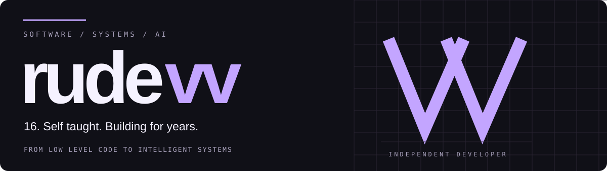
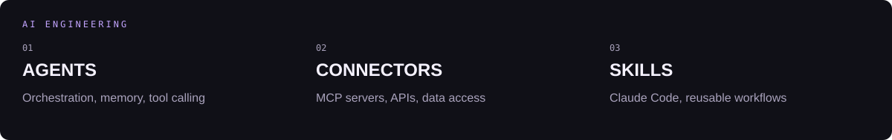
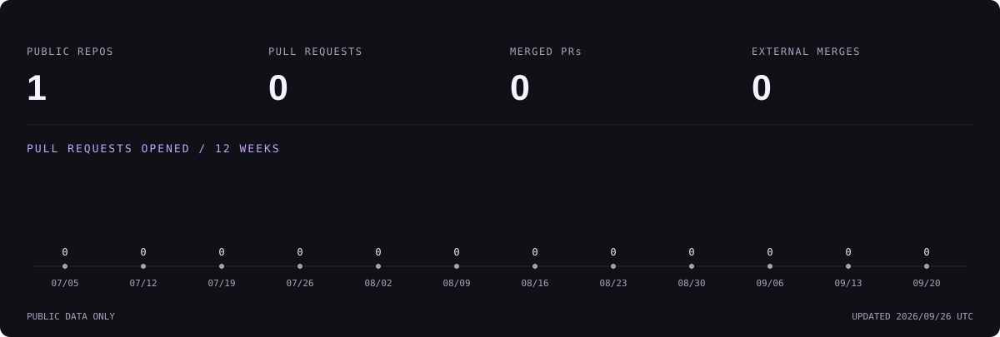

<picture>
  <source media="(prefers-color-scheme: dark)" srcset="assets/header-dark.svg">
  <source media="(prefers-color-scheme: light)" srcset="assets/header-light.svg">
  
</picture>

<a href="#toolbox">Toolbox</a> &nbsp; / &nbsp; <a href="#ai-engineering">AI engineering</a> &nbsp; / &nbsp; <a href="#open-source">Open source</a> &nbsp; / &nbsp; <a href="#activity">Activity</a>

I'm a 16 year old developer with several years of experience building real systems. My work spans application development, backend architecture and low level programming.

I build around clear data models, explicit state and predictable behavior. On the AI side, I work on agent orchestration, MCP integrations, custom tools and skills for Claude Code. The interesting part is making the pieces work together as a system.

## Toolbox

<h3>Languages</h3>

TypeScript, JavaScript, Python, Rust, Go, Assembly, Java, HTML, CSS, Bash.

<h3>Web and interfaces</h3>

React, Next.js, Vue, Nuxt, Angular, Svelte, Astro, Tailwind CSS, Sass, Vite, Redux, Zustand, TanStack Query, Three.js.

<h3>Backend and applications</h3>

Node.js, Bun, Deno, Express, NestJS, FastAPI, Django, Flask, Spring Boot, Gin, Axum, Actix, React Native, Expo, Electron, Tauri.

<h3>Databases and persistence</h3>

PostgreSQL, MySQL, SQLite, MongoDB, Redis, Elasticsearch, DynamoDB, Supabase, Prisma, Drizzle ORM, SQLAlchemy, DuckDB, ClickHouse.

<h3>Infrastructure and delivery</h3>

Docker, Kubernetes, Linux, Nginx, AWS, Cloudflare, Terraform, Ansible, RabbitMQ, Kafka, Grafana, Prometheus.

<h3>Testing and workflow</h3>

Playwright, Vitest, Jest, Cypress, pytest, JUnit, Selenium, Postman, Vite, Webpack, pnpm, Figma.

## AI engineering

<picture>
  <source media="(prefers-color-scheme: dark)" srcset="assets/ai-dark.svg">
  <source media="(prefers-color-scheme: light)" srcset="assets/ai-light.svg">
  
</picture>

<table>
<tr><th align="left">Area</th><th align="left">Stack and practice</th></tr>
<tr><td>Agent development</td><td>LangChain, LangGraph, LlamaIndex, PydanticAI, Vercel AI SDK</td></tr>
<tr><td>Tools and integrations</td><td>MCP, tool calling, structured outputs, API connectors, streaming</td></tr>
<tr><td>Agent customization</td><td>Claude Code, Agent Skills, SKILL.md, hooks, custom commands, reusable workflows</td></tr>
<tr><td>Models and inference</td><td>PyTorch, Hugging Face Transformers, Ollama, vLLM</td></tr>
<tr><td>Retrieval and memory</td><td>RAG, embeddings, semantic search, pgvector, Qdrant, Chroma</td></tr>
<tr><td>Evaluation</td><td>promptfoo, datasets, regression checks, tracing, latency and cost analysis</td></tr>
</table>

## Open source

This account is the home for my public projects and contributions. I'm interested in developer tools, systems programming and AI infrastructure.

<a href="https://github.com/rudevv?tab=repositories">Explore my repositories ↗</a> &nbsp;&nbsp; <a href="https://github.com/pulls?q=is%3Apr+author%3Arudevv+is%3Apublic">Explore my pull requests ↗</a>

<!-- contributions:start -->
My public contribution history starts here.
<!-- contributions:end -->

## Activity

<picture>
  <source media="(prefers-color-scheme: dark)" srcset="assets/activity-dark.svg">
  <source media="(prefers-color-scheme: light)" srcset="assets/activity-light.svg">
  
</picture>

Public GitHub data. The graph tracks pull requests opened during the last 12 weeks. Updated daily. <a href="data/activity.json">View the data</a>.

Built with intent. &nbsp; <strong>rudevv</strong>

